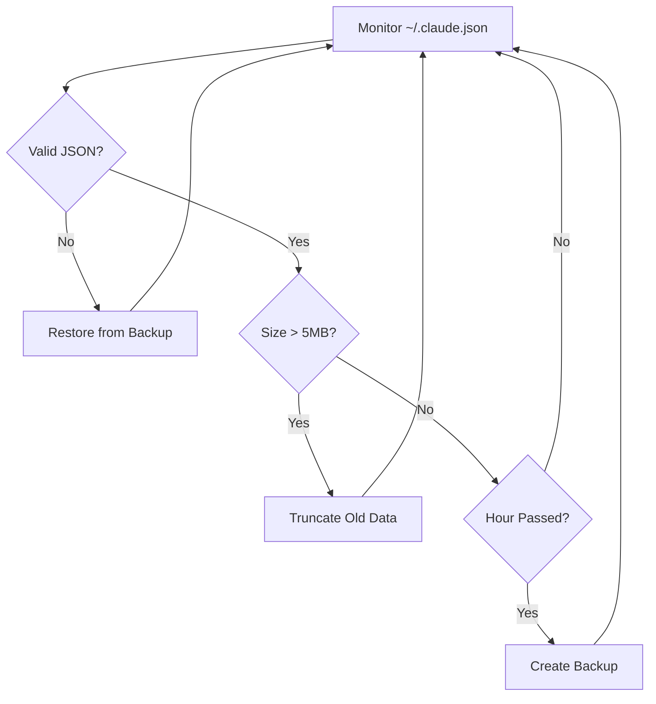

# Claude Config Protector 🛡️

[](https://www.npmjs.com/package/claude-config-protector)
[](https://www.npmjs.com/package/claude-config-protector)
[](https://github.com/jfuginay/claude-config-protector)
-green.svg)


Protect your Claude Code from configuration corruption that causes crash loops and service unavailability.

**NPM Package:** https://www.npmjs.com/package/claude-config-protector  
**GitHub Repo:** https://github.com/jfuginay/claude-config-protector

## The Problem

Claude Code's configuration file (`~/.claude.json`) can grow unbounded and become corrupted, causing:
- 🔴 Service crashes and infinite restart loops (1200+ restarts observed)
- 🔴 Complete loss of Claude Code availability
- 🔴 Manual intervention required every time
- 🔴 Lost productivity and frustration

Users report this happening daily when the config exceeds 8MB. See [issue #2810](https://github.com/anthropics/claude-code/issues/2810).

## The Solution

This protector runs in the background and automatically:
- ✅ **Monitors** config file for size and corruption
- ✅ **Prevents** corruption with atomic write operations
- ✅ **Recovers** automatically from corrupted configs
- ✅ **Truncates** large configs before they hit the 8MB threshold
- ✅ **Backs up** valid configurations hourly

## Quick Start

### Install via npm (Recommended)

```bash
# Install globally
npm install -g claude-config-protector

# Start protection
ccp start

# Check status
ccp status
```

### Install from Source

```bash
# Clone the repository
git clone https://github.com/jfuginay/claude-config-protector.git
cd claude-config-protector

# Run the installer
./install.sh

# Verify it's working
./test.sh
```

## CLI Commands

Once installed, use the `ccp` command (or `claude-config-protector`):

```bash
ccp start      # Start the protector daemon
ccp stop       # Stop the protector daemon
ccp status     # Check if protector is running
ccp fix        # Fix corrupted config file
ccp backup     # Create a manual backup
ccp help       # Show all commands
```

### Manual Installation

1. **Install Node.js** (if not already installed):
   ```bash
   # macOS
   brew install node
   
   # Linux
   sudo apt install nodejs npm
   
   # Windows
   # Download from https://nodejs.org
   ```

2. **Install via npm**:
   ```bash
   npm install -g claude-config-protector
   ```

3. **Set up auto-start** (optional):
   
   **macOS (Launch Agent)**:
   ```bash
   cp com.claude.config.protector.plist ~/Library/LaunchAgents/
   launchctl load ~/Library/LaunchAgents/com.claude.config.protector.plist
   ```
   
   **Linux (systemd)**:
   ```bash
   cp claude-protector.service ~/.config/systemd/user/
   systemctl --user enable claude-protector
   systemctl --user start claude-protector
   ```

## Features

### 🔒 Atomic Write Protection
Prevents partial writes that cause corruption:
```javascript
// Instead of direct writes that corrupt:
fs.writeFileSync(configPath, data)

// Uses atomic operations:
fs.writeFileSync(tempPath, data)
fs.renameSync(tempPath, configPath)  // Atomic operation
```

### 📦 Automatic Backups
- Creates compressed backups before any risky operation (74% size reduction)
- Maintains hourly snapshots of valid configs
- Keeps last 10 backups with automatic rotation
- Stores in `~/.claude-backups/` as gzipped files
- Typical backup size: 18KB (vs 12MB uncompressed)
- Automatic decompression during recovery

### 🔧 Self-Healing Recovery
When corruption is detected:
1. Saves corrupted file for analysis
2. Finds latest valid backup
3. Restores automatically
4. Claude Code continues working

### 📏 Size Management
- Monitors file size continuously
- Truncates at 5MB (well below 8MB danger zone)
- Removes old history and cached data
- Preserves essential configuration

## How It Works



## Verification

Run the test suite to verify everything works:

```bash
./test.sh
```

Expected output:
```
✅ Corruption Recovery
✅ Size Limit Enforcement  
✅ Atomic Write Protection
✅ Backup Creation
✅ Missing File Handling

All tests passed!
```

## Configuration

Edit `protector.js` to customize:

```javascript
const MAX_SIZE = 5 * 1024 * 1024;  // Max file size (5MB default)
const MAX_BACKUPS = 10;             // Number of backups to keep
const CHECK_INTERVAL = 5000;        // Check frequency (5s default)
```

## Troubleshooting

### Check if protector is running
```bash
ccp status
```

### View logs
```bash
tail -f ~/.claude-backups/protector.log
```

### Fix corrupted config
```bash
ccp fix
```

### Emergency recovery
```bash
# Stop Claude
pkill -f claude

# Remove corrupted config
rm ~/.claude.json

# Restore from compressed backup (decompress first)
gunzip -c ~/.claude-backups/claude-*.json.gz > ~/.claude.json

# Or use the built-in fix command
ccp fix

# Restart Claude
claude
```

## File Structure

```
claude-config-protector/
├── protector.js              # Main protection daemon
├── fix-config.js             # One-time fixer for corrupted configs
├── test.sh                   # Test suite
├── install.sh                # Automated installer
├── com.claude.config.plist   # macOS Launch Agent
├── claude-protector.service  # Linux systemd service
└── README.md                 # This file
```

## Performance

- **Memory**: < 10MB
- **CPU**: < 0.1%
- **Disk**: ~180KB for backups (10 compressed files @ 18KB each)
- **Compression**: 74% average reduction (12MB → 18KB per backup)
- **Network**: None (completely local)

## Why This Works

1. **Atomic Operations**: POSIX-compliant rename is atomic, preventing partial writes
2. **Size Limits**: Keeps config well below the 8MB corruption threshold
3. **Proactive Monitoring**: Catches issues before Claude crashes
4. **Automatic Recovery**: No manual intervention needed

## Contributing

Pull requests welcome! Please:
1. Test your changes with `./test.sh`
2. Update documentation
3. Follow existing code style

## License

MIT - Use freely, no warranty provided.

## Acknowledgments

- Thanks to the Claude Code community for reporting [issue #2810](https://github.com/anthropics/claude-code/issues/2810)
- Inspired by database write-ahead logging and journaling filesystems

## Status

This is a community workaround until Anthropic implements the fix in Claude Code itself. Once the official fix is released, this tool will no longer be necessary.

---

**Note**: This tool is not affiliated with Anthropic. It's a community solution to help users experiencing configuration corruption issues.